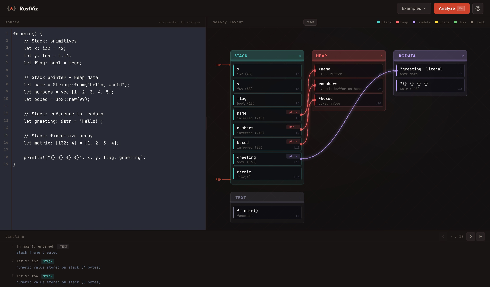

# Rustviz

**Interactive memory visualizer for Rust programs.** Paste any Rust code and instantly see where every variable, literal, and function lives in memory — stack, heap, `.rodata`, `.data`, `.bss`, or `.text`.

Built for developers learning Rust's memory model, especially those coming from managed languages or working in constrained environments like Solana smart contracts.

  



---

## What It Does

You paste Rust code on the left. Rustviz analyzes it and renders an interactive memory map on the right showing exactly which segment each piece of data occupies:

| Segment | Color | What goes here |
|---------|-------|----------------|
| **Stack** | Teal | Local variables, function params, references, struct/enum values |
| **Heap** | Coral | `Box`, `Vec`, `String`, `HashMap`, `Rc`, `Arc`, and other owned allocations |
| **.rodata** | Lavender | String literals, `const`, immutable `static`, vtables |
| **.data** | Gold | Mutable `static` variables |
| **.bss** | Green | Zero-initialized statics (no binary storage cost) |
| **.text** | Gray | Compiled function bodies, method implementations, closure code |

### Key Features

- **Pointer arrows** — glowing animated connections show ownership from stack to heap/rodata
- **`ptr ->` badges** — entries holding pointers are visually tagged
- **RBP/RSP registers** — stack pointer moves dynamically as you step through execution
- **Execution timeline** — step forward/backward through memory operations, watch allocations and drops happen in order
- **Drag-to-rearrange** — click and drag any segment card to reposition it
- **Hover cross-highlighting** — hover code to highlight memory, hover memory to highlight code
- **Click for details** — click any entry for type, size, segment, and reasoning
- **8 built-in examples** — basics, ownership, statics, collections, closures, structs, Solana patterns, advanced

## Quick Start

```bash
git clone https://github.com/abhineetlabs/rust-memory-visualizer.git
cd rust-memory-visualizer
python3 -m http.server 8080
```

Open [http://localhost:8080](http://localhost:8080). No build step, no `npm install`, no dependencies.

## How It Works

Rustviz runs entirely in the browser. There is no backend and no compilation.

1. **Tokenizer** — a full Rust tokenizer handles nested comments, raw strings, lifetimes, attributes, macros, and all syntax edge cases
2. **Analyzer** — walks the token stream and applies heuristic memory classification rules based on type patterns, declaration context, and Rust's ownership semantics
3. **Visualizer** — renders an interactive SVG memory map with animated connections, glow effects, and draggable segments
4. **Timeline** — generates a step-by-step execution trace with drop-order analysis (LIFO)

### What It Handles

The analyzer recognizes these patterns and correctly classifies their memory behavior:

**Heap allocations:** `Box::new`, `Vec::new`, `vec![]`, `String::from`, `format!`, `.to_string()`, `.to_owned()`, `HashMap::new`, `BTreeMap::new`, `HashSet::new`, `BTreeSet::new`, `VecDeque::new`, `LinkedList::new`, `BinaryHeap::new`, `Rc::new`, `Rc::clone`, `Arc::new`, `Arc::clone`, `Mutex::new`, `RwLock::new`, `Box::pin`, `Cow::Owned`, `PathBuf`, `OsString`, `CString`

**Stack patterns:** primitives, fixed-size arrays, tuples, struct/enum instances, references, raw pointers, function parameters, closures, `RefCell::new`, `Cell::new`, `Cow::Borrowed`

**Static data:** `const`, `static`, `static mut`, zero-initialized statics (`.bss`), string/byte literals, vtables for trait objects

**Declarations:** `fn`, `struct`, `enum`, `trait`, `impl`, `impl Trait for Type` (with vtable detection)

**Modifiers:** `pub`, `pub(crate)`, `async`, `unsafe`, `extern`

### Graceful Degradation

Unrecognized patterns are marked as "inferred stack allocation" rather than throwing errors. The tool should never crash on valid Rust input.

## Keyboard Shortcuts

| Key | Action |
|-----|--------|
| `Ctrl+Enter` | Analyze code |
| `Left` / `Right` | Step through timeline |
| `Space` | Play/pause timeline auto-step |
| `Esc` | Close modals |

## Tech Stack

| Component | Choice | Why |
|-----------|--------|-----|
| Editor | CodeMirror 5 | Rust syntax highlighting, lightweight CDN load |
| Visualization | SVG | Resolution-independent, CSS-animatable, interactive |
| Fonts | Outfit + DM Sans + JetBrains Mono | Distinctive typography, not generic |
| Framework | None | Zero build step, zero dependencies |
| Theme | Rust-inspired warm palette | `#CE422B` accent, warm charcoal backgrounds |

## Project Structure

```
index.html              Main page
css/styles.css          Ferris theme, responsive layout, animations
js/rust-analyzer.js     Tokenizer + memory classification engine
js/visualizer.js        SVG renderer, drag system, pointer arrows
js/timeline.js          Execution timeline with playback
js/examples.js          8 built-in example programs
js/app.js               Orchestration, events, tooltips
```

## Limitations

This is a **heuristic analyzer**, not a compiler. It has known limitations:

- Does not execute or compile code — classification is based on pattern matching
- Macro bodies are analyzed based on common patterns (`vec!`, `format!`, `println!`) but custom macros are treated as opaque
- Complex expressions (chained method calls, nested generics) get best-effort analysis
- No cross-function analysis — each function's stack frame is analyzed independently
- Generic type monomorphization is not tracked

## Future Ideas

- **Solana mode** — account data segment, Anchor/Pinocchio macro awareness, stack/heap limit warnings
- **Multiple stack frames** — nested function call visualization
- **Lifetime annotations** — borrow scope visualization
- **WASM tree-sitter** — full AST parsing for better accuracy

## License

[MIT](LICENSE)
